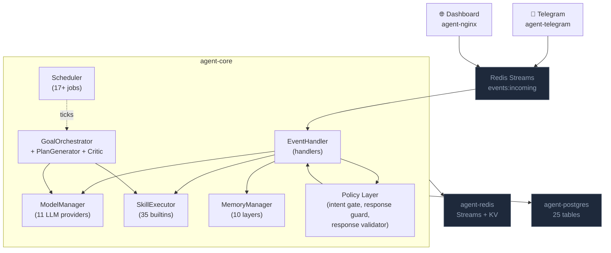

# WASP Documentation

**Current version: v2.7.2** (installer hotfix on top of v2.7.1). See [Changelog](/changelog) for full history.

WASP is a self-hosted, single-operator autonomous agent runtime. It runs as a Docker Compose stack on a VPS or workstation, accepts natural-language instructions through Telegram or a web dashboard, and executes them using a built-in skill library, a goal orchestrator with plan critic, capability tiers per skill, and 10+ named persistent memory layers.

It is designed for one operator. It is not a multi-tenant SaaS platform.

For a comparison against [Hermes Agent](https://github.com/NousResearch/hermes-agent) and [OpenClaw](https://github.com/openclaw/openclaw), see the [comparison table at agentwasp.com](https://agentwasp.com/#comparison).

## What WASP is

- An event-driven Python service that consumes user messages from Redis Streams, plans and executes work, and writes results to PostgreSQL plus a layered memory tree.
- A skill executor with **37 built-in skills** (browser, shell, Python, email, scheduler, sub-agents, self-modification, knowledge graph, vector memory, OpenClaw skill registry…) and a custom-skill loader.
- A goal orchestrator that turns objectives into validated TaskGraphs, runs them step by step, and replans on failure with budget and storm-storm thresholds.
- A scheduler with **41 registered background jobs** (perception, dream, autonomous, behavioral learner, CPI monitor, self-integrity, etc.) with persistent state and catch-up on restart.
- A policy layer that gates side effects, validates response grounding, and enforces schedule honesty before any output reaches the user.
- A web dashboard with **151 HTTP endpoints** covering chat, traces, memory, goals, agents, integrations, models, audit, scheduler, self-improve, cognitive health.

## What WASP is not

- It is not a managed cloud service. You run it on your own VPS.
- It is not a coding agent like Claude Code or Cursor. It is a general-purpose runtime.
- It is not multi-tenant out of the box. One operator per install.
- It is not a guarantee of correctness. The truth layer and policy guards reduce hallucinations and unsafe actions, but the underlying LLM is probabilistic. See [Known Limitations](/known-limitations).

## Architecture summary



Six core services run as Docker containers. A seventh (`agent-ollama`) is optional for fully-local LLM operation.

## Key Systems

| System | Description |
|--------|-------------|
| **Goal Engine** | Decomposes objectives into TaskGraphs (≤ 8 steps), executes with Plan Critic validation, replans on failure |
| **Skills** | 35 built-in skills across 5 capability levels; custom Python skills supported |
| **Memory** | 10 persistent memory layers: episodic, semantic/vector, knowledge graph, procedural, behavioral, learning examples, visual, goal-scoped, temporal world model |
| **Scheduler** | 17 registered jobs (health, reflection, reminders, monitors, custom tasks, dream, autonomous goals, audit retention, weekly DB maintenance) plus opt-in jobs |
| **Policy Layer** | Intent Gate, Action Announcer, Response Guard, Response Validator, Decision Trace — deterministic post-LLM guards |
| **Resource Governor** | Per-user rate limiting: goal slots, LLM budget, API call caps |
| **Decision Layer** | Pre-LLM heuristic classifier with 13 fast-paths, routes requests to 5 strategies before the LLM is invoked |
| **Active Flow Lock** | Per-chat Redis state (TTL 15 min) anchors follow-up messages to the correct domain |
| **Multi-Agent** | Spawn sub-agents with their own goal queues; Meta-Agent Supervisor decomposes into teams |
| **Integrations** | 44 connectors: Slack, Discord, GitHub, Notion, Telegram, Gmail, smart home, exchange APIs |
| **Self-modification** | `self_improve` skill with syntax validation, timestamped backups, soft safety gate, persistent patches |
| **Panic Reset** | Single-operation hard reset wipes all 17 cognitive tables + Redis state + runs `VACUUM FULL` |

## Safety model

Five enforcement points run after the LLM produces a candidate response. All deterministic; none call the LLM:

1. **Intent Gate** — blocks side-effect skills without explicit user intent.
2. **Action Announcer** — strips claims of actions the agent did not actually execute.
3. **Response Guard** — schedule honesty (bidirectional), factual grounding (entity-proximity), markdown sanitizer.
4. **Response Validator** — deterministic grounding/incomplete/drift check; triggers one corrective LLM round if it fails.
5. **Decision Trace** — every response emits a forensic record (visible at `/traces`).

Regression tests (`tests/test_policy_regressions.py`) run at Docker image build time and block the build on failure.

## Quick start

```bash
sudo bash -c "$(curl -fsSL https://agentwasp.com/install.sh)"
```

That single command installs Docker if missing, downloads the release tarball, generates secure secrets, runs the onboarding wizard (Telegram, provider keys, dashboard credentials), builds the containers, and starts the stack. Default install path: `/opt/wasp`.

After install:

```bash
wasp status            # all containers healthy
wasp logs              # tail agent-core
open http://<host>:8080
```

See [Installation](/getting-started/installation) for full prerequisites, distro notes, and advanced flags.

## Reading order

| If you want to... | Start with |
|-------------------|------------|
| Install WASP | [Installation](/getting-started/installation) |
| Use WASP day to day | [Operator Commands](/operations/commands) |
| Understand the architecture | [Agent Architecture](/core-concepts/agent-architecture) |
| Understand the safety model | [Skill Safety](/security/skill-safety) |
| Understand memory and learning | [Memory](/core-concepts/memory) |
| Understand the scheduler | [Scheduler](/core-concepts/scheduler) |
| Add a new skill | [Creating Skills](/development/creating-skills) |
| Diagnose a problem | [Common Errors](/troubleshooting/common-errors) |
| Run audits | [Testing and Audit](/security/testing-and-audit) |
| Know the limits | [Known Limitations](/known-limitations) |

## Current readiness

**Single-operator production.** Verified by:

- A regression suite (50+ deterministic policy assertions) that runs in CI at image build time.
- Multiple internal forensic audits covering mandatory tests, edge validations, adversarial prompts, state consistency, cross-layer integrity, observability, and stress.
- A Panic Reset workflow that wipes all cognitive state with operator confirmation.

WASP is **not** certified for multi-tenant deployment, regulated industries, or unattended operation without monitoring. See [Known Limitations](/known-limitations).
